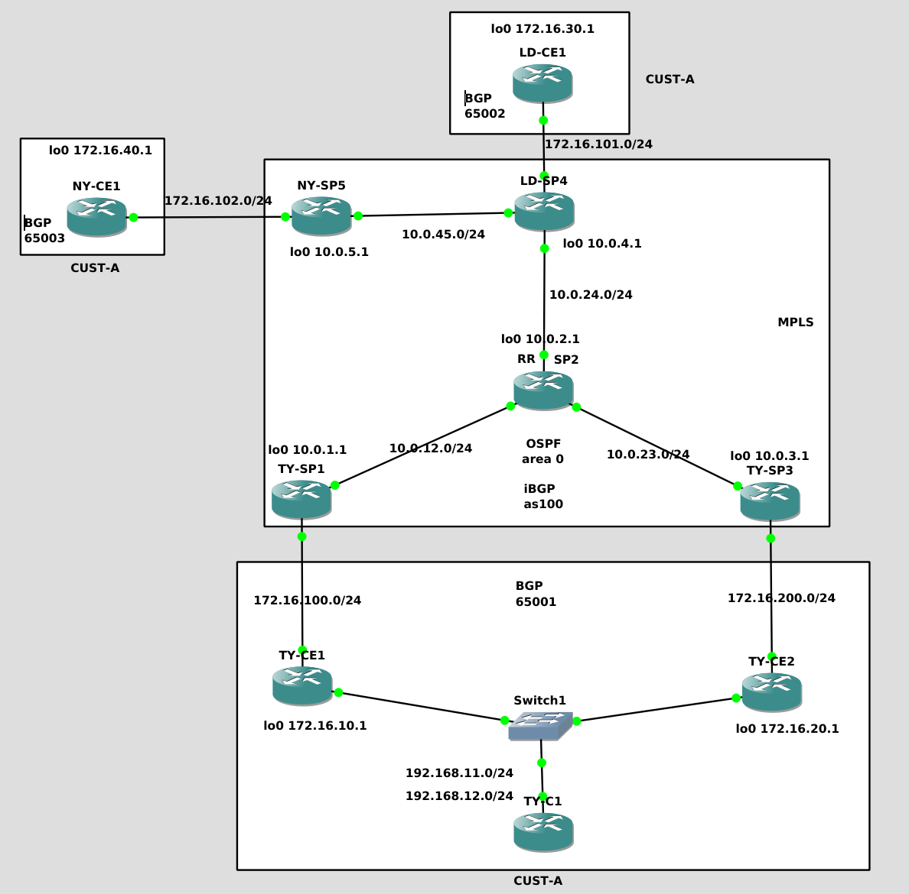

This is a MPLS L3VPN network with a RR PE router. The goal is how to load-balance traffic when having a RR.

Initially we will see the normal behaviour (RR only advertise the best prefix) and then we will make change the RD for CUST-A in the TY-PEx to see how things change.

Further explanations here: https://blog.thomarite.uk/index.php/2020/04/28/gns3-load-balancing-with-route-reflectors-in-a-mpls-l3vpn-networ/

This lab is built on c7200-adventerprisek9-mz.124-24.T2

My laptop is running Debian 10 Testing, Intel i7 and 8GB RAM.

This is the network diagram

